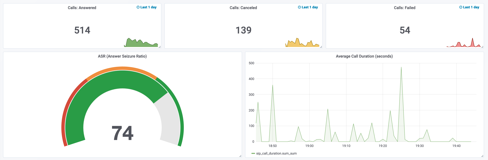

# Playbooks: trial

This playbook is a perfect choice if you want to see how SIP3 will work with real data at your organization. Configure and run SIP3 in your lab with few commands only. Start capturing SIP traffic using SIP3 captain or just configure your PBX to send HEPv3 directly to SIP3 salto. 

_Note: Keep in mind that this version has restrictions in terms of performance and works with SIP protocol only._

## 1. SIP3 backend components as monolithic application (sip3-backend.yml)

This playbook aims to simplify the SIP3 deployment. `sip3-backend.yml` deploys the SIP3 backend components as monolithic application. 

Configuration is simple too - just describe hosts in your network as it's shown here: [`roles/sip3-salto/templates/hosts.yml.j2`](https://github.com/sip3io/sip3-ansible/blob/master/roles/sip3-salto/templates/hosts.yml.j2)

To install SIP3 backend components run the following command (use `port` variable if you want to change default binding):
```
ansible-playbook -K playbooks/trial/sip3-backend.yml --extra-vars "port=80"
```
To uninstall SIP3 backend components run the same command but with `state=absent` variable:
```
ansible-playbook -K playbooks/trial/sip3-backend.yml --extra-vars "state=absent"
```

_Note: To verify that SIP3 has been installed properly open: http://localhost_

Now you are the one step away from seeing SIP3 in action.

## 2. SIP3 captain (sip3-captain.yml)

Once you have finished installing the SIP3 backend components, it's time to deploy SIP3 captain. This component is responsible for capturing and filtering raw SIP traffic data. You can use SIP3 captain as an agent by deploying it to the node with SIP traffic.

Configuration of the SIP3 captain is a little more complicated than the one of the SIP3 backend components, but still simple enough. Check it out here: [`roles/sip3-captain/templates/application.yml.j2`](https://github.com/sip3io/sip3-ansible/blob/master/roles/sip3-captain/templates/application.yml.j2)

To install SIP3 captain run the following command:
```
ansible-playbook -K playbooks/trial/sip3-captain.yml
```

To uninstall SIP3 captain run the same command but with `state=absent` variable:
```
ansible-playbook -K playbooks/trial/sip3-captain.yml --extra-vars "state=absent"
```

## 3. SIP3 Metrics

We supply Grafana together with the trial version of SIP3. Just open http://localhost/grafana and use default creadentials(`admin/admin`). After that you will see `Calls Statistic` dashboard:


 
_Note: Now you are able to create custom dashboards on your own. Explore what metrics are available out-of-the-box or ask in our community channels._

## 4. Support

If you face any problems installing the trial version of SIP3, just leave us a message in our community [Slack](https://join.slack.com/t/sip3-community/shared_invite/enQtNzcwMzUxODA2MTkyLTcxODE2MzYyZDgzOWJjNDQ5MzJkOTU3MDY3NDNmZjQ2Zjg2ZjA2MzY4ZmM0YmFkZGI3ZjZiMDgwM2Y1YmU1Mzk) and [Telegram](https://t.me/sip3io), or send us an [email](mailto:support@sip3.io). We will be happy to help you.
