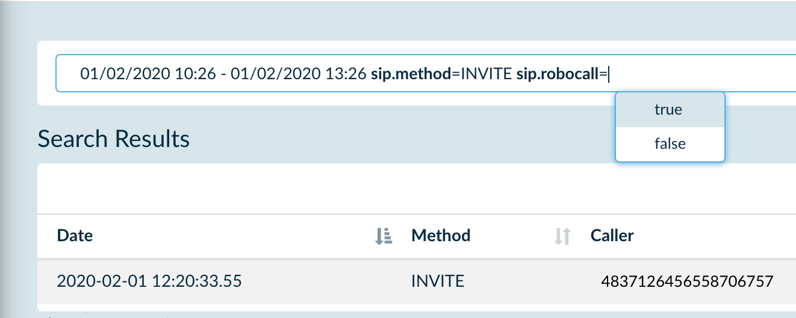
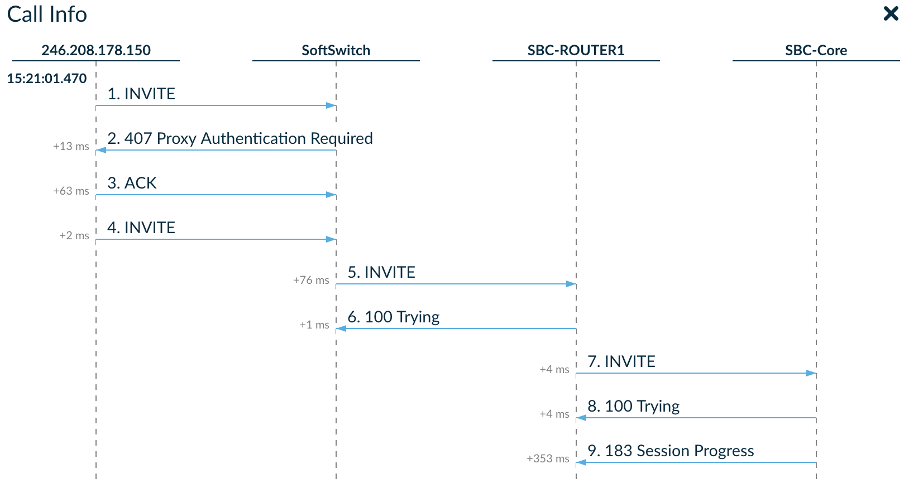

# Playbooks: trial

This playbook is a perfect choice if you want to see how SIP3 will work with real data at your organization. Configure and run SIP3 in your lab with few commands only. Start capturing SIP traffic using SIP3 captain or just configure your PBX to send HEPv3 directly to SIP3 salto. 

_Note: Keep in mind that this version has restrictions in terms of performance and works with SIP protocol only._

## 1. SIP3 backend components as monolithic application (sip3-backend.yml)

This playbook aims to simplify the SIP3 deployment. `sip3-backend.yml` deploys the SIP3 backend components as monolithic application. 

To install SIP3 backend components run the following command (use `port` variable if you want to change default binding):
```
ansible-playbook -K playbooks/trial/sip3-backend.yml --extra-vars "port=80"
```
To uninstall SIP3 backend components run the same command but with `state=absent` variable:
```
ansible-playbook -K playbooks/trial/sip3-backend.yml --extra-vars "state=absent"
```

_Note: To verify that SIP3 has been installed properly open: http://localhost and http://localhost/grafana (use default creadentials: `admin/admin`)_

_Note: This version of SIP3 shipped together with Grafana which we recommend to use as a main monitoring tool. To make it simple SIP3 UI re-uses Grafana Authorization API, so just use Grafana console to manage your users._

Now you are the one step away from seeing SIP3 in action.

## 2. SIP3 captain (sip3-captain.yml)

Once you have finished installing the SIP3 backend components, it's time to deploy SIP3 captain. This component is responsible for capturing and filtering raw SIP traffic data. You can use SIP3 captain as an agent by deploying it to the node with SIP traffic.

Configuration of the SIP3 captain is simple enough. Check it out here: [`roles/sip3-captain/templates/application.yml.j2`](https://github.com/sip3io/sip3-ansible/blob/master/roles/sip3-captain/templates/application.yml.j2)

To install SIP3 captain run the following command:
```
ansible-playbook -K playbooks/trial/sip3-captain.yml
```

To uninstall SIP3 captain run the same command but with `state=absent` variable:
```
ansible-playbook -K playbooks/trial/sip3-captain.yml --extra-vars "state=absent"
```

## 3. SIP3 User-Defined Functions

Use [`roles/sip3-salto/templates/udf/sip_message_udf.groovy.j2`](https://github.com/sip3io/sip3-ansible/blob/master/roles/sip3-salto/templates/udf/sip_message_udf.groovy.j2) template to write your very first SIP3 User-Defined Function.

You can start from adding custom `Boolean` or `String` search criteria, like it's shown on the picture below:


Read more about how to write and use SIP3 UDFs [here](https://github.com/sip3io/sip3-documentation/blob/master/modules/ROOT/pages/features/UserDefinedFunctions.adoc).

## 4. SIP3 Metrics

As mentioned above this version of SIP3 shipped together with Grafana. Just open http://localhost/grafana (use default creadentials: `admin/admin`). After that you will see `Technical Dashboard`, like it shown on the picture below:


 
_Note: Now you are able to create custom dashboards on your own. Explore what metrics are available out-of-the-box or ask in our community channels._

## 5. SIP3 HostMap

At the moment there is no way to configure HostMap automatically. This will be fixed as soon as SIP3 team will push `sip3-twig-ce` code to github.

As a workaround you can describe your hosts using direct injection to Mongo:

```
# docker exec -it sip3-mongodb mongo
# use sip3
# db.hosts.insert({"name" : "SoftSwitch", "sip": ["209.253.93.85", "10.10.0.1"]})
```

Hosts described in Mongo will be automarically provisioned within SIP3. That will help you to correlate calls passing through a B2BUA node which has 2 diffenrent network interfaces for incoming and outgoing traffic, like it's shown on the picture below: 


## 6. Support

If you face any problems installing the trial version of SIP3, just leave us a message in our community [Slack](https://join.slack.com/t/sip3-community/shared_invite/enQtOTIyMjg3NDI0MjU3LWUwYzhlOTFhODYxMTEwNjllYjZjNzc1M2NmM2EyNDM0ZjJmNTVkOTg1MGQ3YmFmNWU5NjlhOGI3MWU1MzUwMjE) and [Telegram](https://t.me/sip3io), or send us an [email](mailto:support@sip3.io). We will be happy to help you.
